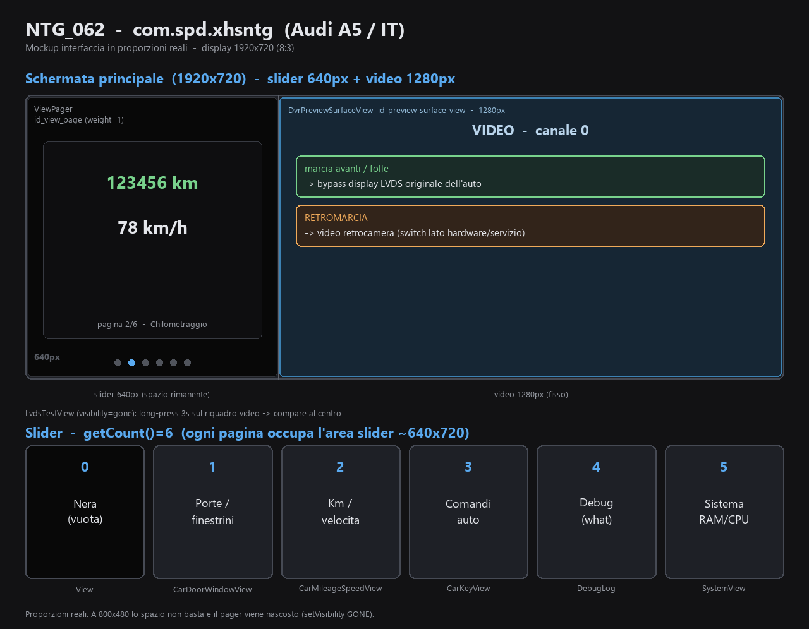

# NTG_062 — app modificata (`com.spd.xhsntg`) + sorgenti

App launcher per testate Android **Mercedes/Audi NTG**, decompilata da `NTG_062.apk` e modificata
(Audi A5 / italiano / alleggerita). Niente root né chiave di piattaforma → installata come app
normale (Strada C, vedi Note).

## Indice
- [Struttura della cartella](#struttura-della-cartella)
- [Layout principale (`activity_fullscreen.xml`)](#layout-principale-activity_fullscreenxml)
  - [`DvrPreviewSurfaceView` — riquadro video (bypass LVDS / retrocamera)](#dvrpreviewsurfaceview--riquadro-video-bypass-lvds--retrocamera)
- [Pagine dello slider](#pagine-dello-slider)
  - [App modificata — stato attuale dei sorgenti (`NTG_062_src/`)](#app-modificata--stato-attuale-dei-sorgenti-ntg_062_src)
  - [App originale (`NTG_062_original.apk`, `com.spd.xhsntg`)](#app-originale-ntg_062_originalapk-comspdxhsntg)
- [Modifiche e ottimizzazioni applicate (questa sessione)](#modifiche-e-ottimizzazioni-applicate-questa-sessione)
  - [Funzionali / UI](#funzionali--ui)
  - [Ottimizzazioni velocità / peso](#ottimizzazioni-velocità--peso)
  - [Non fatto / scartato](#non-fatto--scartato)
- [Analisi componenti rimovibili](#analisi-componenti-rimovibili)
  - [Quadro generale](#quadro-generale)
  - [Tier 1 — Codice libreria morto · ~11 MB smali, rischio zero](#tier-1--codice-libreria-morto--11-mb-smali-rischio-zero)
  - [Tier 2 — Componenti app nascosti/diagnostici](#tier-2--componenti-app-nascostidiagnostici)
  - [Tier 3 — Feature rimovibili solo se l'hardware non c'è](#tier-3--feature-rimovibili-solo-se-lhardware-non-cè)
  - [Tier 4 — Asset (ricomprimere, non rimuovere)](#tier-4--asset-ricomprimere-non-rimuovere)
- [Ricompilare → firmare → installare](#ricompilare--firmare--installare)
- [Script `compile_sign_align.sh`](#script-compile_sign_alignsh)
  - [Modalità d'uso](#modalità-duso)
  - [Cosa fa nel dettaglio](#cosa-fa-nel-dettaglio)
  - [Note](#note)
- [Servizio CarInfo (telemetria veicolo)](#servizio-carinfo-telemetria-veicolo)
  - [Come l'app dialoga col servizio](#come-lapp-dialoga-col-servizio)
  - [Famiglie di dati (range `what`)](#famiglie-di-dati-range-what)
  - [Cosa usa l'app oggi](#cosa-usa-lapp-oggi)
  - [Limiti (onestà tecnica)](#limiti-onestà-tecnica)
- [Note importanti](#note-importanti)

## Struttura della cartella
- **`NTG_062_original.apk`** — APK originale del vendor (fonte di verità, ri-decodificabile), 10.5 MB.
- **`NTG_062_audi_it.apk`** — build modificata, zipallineata + firma **v2/v3** (da installare), **1.41 MB**.
- **`NTG_062_src/`** — sorgenti decompilati:
  - `apktool/` — smali + risorse + manifest. **Qui si modifica e si ricompila.**
  - `java/` — Java leggibile (jadx), solo per consultazione (`java/com/spd/`).
- **`compile_sign_align.sh` · `zipalign.py` · `uber-apk-signer.jar` · `debug.keystore`** — toolchain build+firma+zipalign.
- **[`DATI_MOSTRABILI.md`](DATI_MOSTRABILI.md)** — catalogo dei dati CarInfo (`what`) mostrabili al posto del chilometraggio + come sostituirli.
- **[`mockup.md`](mockup.md) · [`mockup.png`](mockup.png)** — mockup dell'interfaccia (schermata principale + 6 pagine), in ASCII e in versione grafica.
- **`.claude/memory/ntg062-*.md`** — contesto, trappole e dettagli per modifiche future.

## Layout principale (`activity_fullscreen.xml`)

`FullscreenActivity` (l'activity di avvio, a tutto schermo) gonfia
[activity_fullscreen.xml](NTG_062_src/apktool/res/layout/activity_fullscreen.xml). È un **`FrameLayout`**
(per sovrapporre l'overlay di test) che contiene un **`LinearLayout` orizzontale** (`background=#ff000000` —
lo sfondo `bg.png` da 1.5 MB è stato **rimosso**: era coperto da ViewPager+preview, mai visibile)
con due elementi affiancati, **più** una view di test nascosta sopra a tutto:

| Vista | ID | Larghezza | Ruolo |
|---|---|---|---|
| `androidx.viewpager.widget.ViewPager` | `id_view_page` | `0px` + `weight=1` (riempie lo spazio rimanente) | Lo **slider** con le pagine info-auto (`background=#f000` → sfondo nero). Vedi [Pagine dello slider](#pagine-dello-slider). |
| `com.spd.xhsntg.DvrPreviewSurfaceView` | `id_preview_surface_view` | **`1280px`** fissi, `layout_gravity=right` | Il **riquadro video** del DVR/cattura (`custom:dvr_channel="0"`). Vedi sotto. |
| `com.spd.view.LvdsTestView` | `ldvs_test_layout` | `wrap_content`, `layout_gravity=center` | Schermata di **test LVDS di fabbrica**, `visibility="gone"`. Compare con **long-press** sul riquadro video (in questa sessione: 3s, vincolo `SETTING_DEVELOPER_MODE` rimosso, vedi `.claude/memory/ntg062-slider.md`). |

Quindi a schermo: **a sinistra lo slider** (largo quanto avanza), **a destra un riquadro fisso da 1280px
col video**. La larghezza del riquadro può diventare a tutto schermo a seconda di `SETTING_NTG_FULL_SCREEN`
(letto in `m_show_preview_mode`: `1` → `match_parent`, `0` → larghezza calcolata da `getPreviewViewWidth()`).

Mockup grafico: [`mockup.png`](mockup.png) · versione testuale: [`mockup.md`](mockup.md).



```
 Schermata principale — display widescreen (es. 1920x720), split orizzontale
 +--------------------------+-----------------------------------+
 |  ViewPager  id_view_page |  DvrPreviewSurfaceView             |
 |  (slider, weight=1)      |  id_preview_surface_view * 1280px  |
 |  spazio rimanente        |                                    |
 |                          |   +----------------------------+   |
 |     pagina corrente      |   |  VIDEO canale 0            |   |
 |     (es. Chilometraggio) |   |                            |   |
 |   +-------------------+  |   |  marcia avanti/folle ->    |   |
 |   |   123456 km       |  |   |    bypass display LVDS     |   |
 |   |   78 km/h         |  |   |    originale dell'auto     |   |
 |   +-------------------+  |   |                            |   |
 |                          |   |  RETROMARCIA ->            |   |
 |   o * o o o o            |   |    video retrocamera       |   |
 |  (6 pagine, sfondo nero) |   +----------------------------+   |
 +--------------------------+-----------------------------------+
     LvdsTestView (gone): long-press 3s sul riquadro -> compare al centro
```
> Le proporzioni dipendono dalla risoluzione: il riquadro video e sempre 1280px, lo slider occupa
> lo spazio restante. A 800x480 lo spazio non basta e il pager viene nascosto (`setVisibility(GONE)`).

### `DvrPreviewSurfaceView` — riquadro video (bypass LVDS / retrocamera)

È una `SurfaceView` che mostra l'anteprima di **un canale del box DVR/cattura esterno**. L'app
**non cattura nulla**: è solo **client AIDL** del servizio `com.spd.dvr` (action `com.spd.service.dvrservice`),
wrappato in [DvrHelper.java](NTG_062_src/java/com/spd/xhsntg/DvrHelper.java). Risoluzione/fps/codec li
decide il servizio + l'hardware.

- **Canale 0 = bypass dell'ingresso video LVDS del display originale dell'auto**: nel riquadro destro la
  testata mostra esattamente ciò che mostrava il display di fabbrica.
- **In retromarcia** quel canale 0 commuta sul **video della retrocamera**. La commutazione della sorgente
  avviene a **livello hardware/servizio DVR**, **non** in questo APK: l'app continua a fare la preview
  dello stesso canale 0. La classe [ReverseBroadcast.java](NTG_062_src/java/com/spd/xhsntg/ReverseBroadcast.java)
  (broadcast `com.spd.action.ntg.reverse.START`/`.STOP`, extra `reverse`) si limita a **portare
  `FullscreenActivity` in primo piano** e a notificare i `Callback.onReverseState` — non cambia canale.
- **Modi** (`m_dvr_video_mode`): `0` chiuso · `1` preview/record · `2` playback. Attributo XML
  `custom:dvr_video_mode` (default `1`).
- **Ciclo di vita preview**: [FullscreenActivity](NTG_062_src/java/com/spd/xhsntg/FullscreenActivity.java)
  in `onResume`+servizio connesso chiama `checkPreviewShow()` → `setDvrChannel(1, 0)`
  (→ `DvrHelper.startPreviewByChannel(0, surface)`); in `onPause` → `setDvrChannel(0, 0)` (chiude).
  Comandi noti via `dvrControlCmd`: `1001` stop preview · `1004` playstate · `1007` stop playback · `1010` seek.

> Conseguenza pratica: da questo APK **non** si può cambiare cosa appare in retromarcia (è lato servizio),
> ma si potrebbe agire su qualità/fps del canale 0 via `getSettingInfo`/`setSettingInfo`. Serve però
> decompilare `com.spd.dvr` per mappare gli `int` → risoluzione/fps/codec. Vedi
> `.claude/memory/ntg062-dvr-tuning.md` (Fase 2).

## Pagine dello slider

L'app è uno slider orizzontale (`ViewPager` + `MyViewPageAdapter`): si scorre tra schermate a tutto
display. Quante e quali pagine compaiono è deciso da `MyViewPageAdapter.getCount()` + lo `switch` di
`instantiateItem`.

```
 Slider (app modificata) — getCount()=6, swipe orizzontale tra le pagine
 +--------+ +--------+ +--------+ +--------+ +--------+ +--------+
 |   0    | |   1    | |   2    | |   3    | |   4    | |   5    |
 | (nera) | | porte/ | |  km /  | |sensori | | debug  | |sistema |
 | vuota  | |finestr.| | veloc. | | marcia | | (what) | |RAM/CPU |
 +--------+ +--------+ +--------+ +--------+ +--------+ +--------+
   View      CarDoor    CarMile    CarSensor  DebugLog   SystemView
   (vuota)   WindowView SpeedView  View       (overlay)  (refresh 1s)
```

### App modificata — stato attuale dei sorgenti (`NTG_062_src/`)
`getCount() = 6`. Rispetto all'originale: **pagina mappa/navi rimossa** e **pagina nera aggiunta come
nuovo indice 0** (ultime modifiche di questa sessione).

| Indice | Pagina | Descrizione | Componenti / risorse / servizi coinvolti |
|---|---|---|---|
| **0** | Nera (vuota) | Vista vuota senza sfondo né funzionalità; appare **nera** perché il `ViewPager` ha `background=#f000`. Nessun listener/tocco. | **Classe**: `android.view.View` (`m_test_view_0`). **Risorse**: nessuna. **Servizi/dati**: nessuno. |
| **1** | Porte / finestrini | Sagoma auto con stato apertura di porte, cofano, baule e finestrini. | **Classi**: `CarDoorWindowView` (+`$1`). **Layout**: `carinfo_benz_car_door_layout.xml`. **Drawable**: 15 `carinfo_audi_car_door_*_02` (solo Audi tipo `_02`). **ID**: `id_car_door_bg/front_left/front_right/hood/rear_left/rear_right/trunk`. **Dato CarInfo**: porte `what=50001` (push `onUpdateDoors`→`updateDoors`). **Setting**: `SETTING_BENZ_CAR_TYPE` (fissato a 2). |
| **2** | Chilometraggio / velocità | Chilometraggio totale e velocità istantanea (unità KM/MILE · KM/H/MPH). | **Classe**: `CarMileageSpeedView`. **Layout**: `mileage_layout.xml` (ID `mileage`, `speed`). **Dati CarInfo**: mileage `what=100013`, velocità `140062`, unità `10006` (push `updateMileage`/`updateSpeed`). **Stringhe**: `carinfo_mileage`, `carinfo_speed`. |
| **3** | Sensori / marcia | Sensori di parcheggio (barre Anteriore/Posteriore/Sinistra/Destra) + marcia + retromarcia. **Sostituisce** la vecchia CarKeyView (tasti non funzionanti, **rimossa** con `key_one_layout.xml`). | **Classe**: `CarSensorView` (+`$1` ticker), UI costruita in codice (no layout), barre `ProgressBar`. **Dati CarInfo** (`ReverseAndAVM`, in PULL, polling 300 ms): `GEAR=140080`, `REVERSE=140011`, `RADAR_LEVEL=140006-140009`, `RADAR_DISTANCE=140016/140017`. **Trigger**: `onPageSelected==3` → `CarSensorView.start()`/`stop()`. |
| **4** | Diagnostica (debug) | Overlay che logga a schermo i codici `what` CarInfo + scrive un file in Download. Aggiunta in sessione precedente. | **Classi**: `DebugLog` (+`$DumpTask`). **Dati**: legge l'intero dizionario `CarInfo$*`. **Trigger**: `FullscreenActivity$1.onPageSelected==4` → `DebugLog.dumpAll()`. **Permesso**: `WRITE_EXTERNAL_STORAGE`. |
| **5** | Sistema | Parametri headunit Android (RAM/CPU/temperatura) letti senza root, refresh ogni 1s. Aggiunta in sessione precedente. | **Classi**: `SystemView` (+`$1`). **Fonti**: `ActivityManager.MemoryInfo` (RAM), `/proc`–`/sys` (CPU/temp) — nessun servizio CarInfo. **Trigger**: `onPageSelected==5` → `SystemView.start()`/`stop()` (timer refresh 1s). |

> Le pagine 4 e 5 entrano in azione per indice nel listener `FullscreenActivity$1.onPageSelected`
> (4 → dump diagnostico one-shot, 5 → avvio/stop refresh Sistema): la rimozione navi (−1) e l'aggiunta
> della pagina nera (+1) si compensano, quindi quegli indici restano 4 e 5 e il listener non va toccato.

### App originale (`NTG_062_original.apk`, `com.spd.xhsntg`)
`getCount() = 3` → si scorrono **solo gli indici 0, 1, 2**. La pagina all'indice 3 esiste nello `switch`
ma è **irraggiungibile** via swipe (pagina nascosta di fabbrica).

| Indice | Pagina | Descrizione | Componenti / risorse / servizi coinvolti |
|---|---|---|---|
| **0** | Porte / finestrini | Stato apertura porte/cofano/baule/finestrini su sagoma auto (firmware multi-marca: famiglie Benz + Audi). | **Classi**: `CarDoorWindowView` (+`$1`). **Layout**: `carinfo_benz_car_door_layout.xml`. **Drawable**: intera famiglia `carinfo_benz_car_door_*` + `carinfo_audi_car_door_*` (tipi `_00/_01/_02/_03`, ~180 file). **ID** `id_car_door_*`. **Dato CarInfo** porte `what=50001`. **Setting** `SETTING_BENZ_CAR_TYPE` (marca/sagoma). |
| **1** | Chilometraggio / velocità | Chilometraggio totale e velocità istantanea. | **Classe**: `CarMileageSpeedView`. **Layout**: `mileage_layout.xml` (+ sfondo `car_info_bg`). **Dati CarInfo**: mileage `100013`, velocità `140062`, unità `10006`. **Stringhe** `carinfo_mileage`/`carinfo_speed`. |
| **2** | Navigazione / mappa | **Non è una mappa vera**: widget di info-svolta (icona manovra, distanza, prossima strada) alimentato in live dai broadcast di **AMap Auto / WeCar Navi**; al tocco lancia l'app di navigazione impostata in `SETTING_NAVI_APP`. | **3 servizi/manager**: `NaviManager` (orchestratore) → `AmapAutoNaviFrameManager` (AMap Auto) + `WeCarNaviFrameManager` (Tencent WeCar); inner `NaviManager$1` (click→lancio app), `NaviManager$2` (ContentObserver su `SETTING_NAVI_APP`). **Layout** `navi_layout.xml` (frame `m_navi_frame_layout`). **Drawable** `navi_bg`/`navi_tip` + asset `a_map_auto_tip_*` (29, AMap) e `cross_tip_*` (70, WeCar). **ID** `id_text_navi_cross_*`. **Stringa** `app_name_navigation`. **Broadcast** `AUTONAVI_STANDARD_BROADCAST_SEND/RECV`. **Setting** `SETTING_NAVI_APP`. **App esterne** `com.autonavi.amapauto`, `com.tencent.wecarnavi`. **SDK** `com/tencent`+`com/google`+gson, `GuideInfoExtraKey`. |
| **3** | Comandi auto — **NASCOSTA** | Pannello comandi auto; presente nel codice ma non scorribile perché `getCount()=3`. | **Classe**: `CarKeyView`. **Layout**: `key_one_layout.xml` (+ sfondo `car_info_bg`). **Drawable** `icon_04`/`icon_08`, `carinfo_button_*`. **Azioni/servizi**: `CarInfoManager.setKeyEvent`; luminosità `SpdManager.setSystemCmd(5,…)`. |

> Differenze chiave originale → modificata: la **navi (mappa)** è stata rimossa del tutto; la pagina
> **comandi** (ex nascosta) è stata resa visibile; sono state aggiunte **debug** e **Sistema**; ed è stata
> anteposta una **pagina nera**. Vedi sotto per il dettaglio delle modifiche.

## Modifiche e ottimizzazioni applicate (questa sessione)

### Funzionali / UI
1. **4ª pagina abilitata** — `MyViewPageAdapter.getCount()` 3→4: la pagina nascosta `CarKeyView`
   (pannello comandi auto) diventa scorribile.
2. **Sagoma auto = solo Audi (tipo `_02`, berlina/A5)** — tenuti i 15 `carinfo_audi_car_door_*_02`;
   eliminati l'intera famiglia `benz` + audi `_00/_01/_03` (**165 file, ~6.5 MB**) e le righe in
   `public.xml`; tipo fissato a 2 in `CarDoorWindowView.smali`; `src` di
   `carinfo_benz_car_door_layout.xml` ripuntati su audi `_02`.
3. **Testi in italiano** — tradotte 7 stringhe app in `values/strings.xml`
   (`app_name→Auto`, `app_name_navigation→Navigazione`, `carinfo_mileage→Chilometraggio`,
   `carinfo_speed→Velocità`, ecc.).
4. **Solo lingua italiana** — eliminate **112** cartelle `res/values-<lingua>`, tenuta solo `values-it`
   (forza l'italiano via fallback sul default).
5. **Installabile via sideload** — rimosso `android:sharedUserId="android.uid.system"` dal manifest.
6. **Sfondo `car_info_bg` rimosso** — tolto l'`<ImageView>` da `mileage_layout.xml` e `key_one_layout.xml`,
   eliminato `car_info_bg.png` + voce `public.xml`. Le schermate restano sul nero del ViewPager.

### Ottimizzazioni velocità / peso
7. **Rimosso l'SDK Tencent WeCar/TAES + gson** (~**725 classi, ~5 MB** di smali) — `WeCarNaviFrameManager`
   ridotto a stub no-op; eliminati `smali/com/tencent`, `smali/com/google`, le inner-class, gli asset
   `assets/cross_tip_*.png` (70) e `assets/component_config*.json`. Dex più piccolo → caricamento classi
   e RAM ridotti. `NaviManager`/`AmapAutoNaviFrameManager` non toccati (i ref a Tencent erano costanti
   `static final` già inlined dal compilatore).
8. **PNG ottimizzati** (`optipng` lossless, `-strip all`) — −151 KB.
9. **Rimosso completamente anche AMap Auto** — `AmapAutoNaviFrameManager` ridotto a stub; eliminati le
   inner-class, `GuideInfoExtraKey`, gli asset `assets/a_map_auto_tip_*.png` (29); ripuliti i placeholder
   di `navi_layout.xml`. La pagina navigazione diventa un **riquadro statico** che al tap lancia
   `SETTING_NAVI_APP` (es. Google Maps) — **niente più pannello live** (era alimentato solo da AMap).
10. **Rimosse 3 stringhe navi inutilizzate** (`distance_metre_after`, `distance_kilometer_after`,
    `enter`) da `values/strings.xml`, `values-it/strings.xml` e `public.xml`.

- Build consegnata `NTG_062_audi_it.apk`: dopo le ottimizzazioni di **questa** sessione (vedi sotto) è scesa a **1.41 MB** (da 10.5 MB originali), firma v2/v3 con la chiave del repo.

> **Aggiornamento sessione 2026-06-25** (oltre ai punti sopra): (a) **debloat sicuro** — rimossi `bg.png` (1.5 MB), `car.png` (orfana) e l'**isola media morta** `androidx/media`+`android/support/v4/media` (601 classi); (b) **pagina indice 3 ricostruita** — rimossa `CarKeyView` (tasti non funzionanti), aggiunta `CarSensorView` (sensori parcheggio + marcia, barre grafiche, dati da `CarInfo.ReverseAndAVM`); (c) **build+firma su Windows** validate (apktool 3.0.2, firma v2/v3 via JDK 12 con la chiave del repo).

### Non fatto / scartato
- A2 (rimozione UI debug LVDS) e B1 (anticipo bind DVR): impatto trascurabile.
- **Fase 2 — qualità/FPS DVR**: in attesa dell'APK del servizio esterno `com.spd.dvr` (la cattura
  video la fa quel servizio; quest'app è solo client AIDL). Vedi `.claude/memory/ntg062-dvr-tuning.md`.

## Analisi componenti rimovibili

Mappa dei componenti rimovibili, ordinata per rapporto guadagno/rischio.

### Quadro generale
Su **1639 classi di libreria** presenti nello smali, solo **96 sono raggiungibili** dal codice dell'app. L'app usa di fatto **solo `androidx.viewpager.widget`** (lo slider), che trascina un sottoinsieme minimo di `core`/`customview`/`collection`/`annotation`. Tutto il resto è zavorra importata dall'umbrella `legacy-support-v4`.

### Tier 1 — Codice libreria morto · ~11 MB smali, rischio zero
> ✅ **Parzialmente FATTO (2026-06-25)**: rimossi `androidx/media` (434) + `android/support/v4/media` (167) = **601 classi** (isola morta, closure verificata). Gli altri moduli sotto restano da valutare (attenzione alle dipendenze transitive di `viewpager`).

Moduli interi **0 classi raggiungibili / N totali** → cancellabili in blocco (cartelle):

| Modulo | classi | note |
|---|---|---|
| `androidx/media` | 434 | il più pesante (3.7 MB), MediaSession/MediaBrowser mai usati |
| `android/support/v4` | 178 | vecchia support-lib, tiene in vita `androidx/media` |
| `androidx/fragment` | 87 | l'app non usa Fragment |
| `androidx/lifecycle` | 76 | — |
| `androidx/legacy` | 43 | l'umbrella stessa |
| `androidx/loader` | 35 | — |
| `swiperefreshlayout`, `drawerlayout`, `slidingpanelayout`, `coordinatorlayout`, `cursoradapter`, `documentfile`, `print`, `arch`, `asynclayoutinflater`, `interpolator`, `localbroadcastmanager`, `versionedparcelable` | ~290 | tutti 0-raggiungibili |

Questo è il **vero grande taglio**: ~1543 classi morte → il `classes.dex` (oggi 2.2 MB) si riduce drasticamente.

> ⚠️ I moduli **parziali** (`core`, `viewpager`, `customview`, `collection`, `annotation`) **NON** vanno cancellati interi: solo alcune classi al loro interno sono morte, ma rimuoverle una a una è chirurgico e a basso rendimento → li lascerei intatti.

### Tier 2 — Componenti app nascosti/diagnostici
- **`LvdsTestView`** (5 file: classe + 4 inner) — è una **schermata di test LVDS di fabbrica**, nel layout è `android:visibility="gone"` e non è referenziata da nessun'altra classe. Rimozione pulita: 5 smali + 1 riga in [activity_fullscreen.xml](NTG_062_src/apktool/res/layout/activity_fullscreen.xml#L8) + l'`@id`. Era l'opzione "A2" deprioritizzata in memoria.
- **`DebugLog` + `DebugLog$DumpTask`** — logging di debug, agganciato a `MyViewPageAdapter` e `FullscreenActivity$1`. Rimovibile ma richiede edit ai due chiamanti; tienilo solo se ti serve per il logcat sulla testata (TODO aperto).

### Tier 3 — Feature rimovibili solo se l'hardware non c'è
- **Stack DVR/dashcam** (~400 KB): `com/spd/dvr/*` + `DvrHelper*` + `DvrPreviewSurfaceView`, agganciato a `FullscreenActivity`. Rimovibile **solo se non hai una dashcam** collegata.
- **`ReverseBroadcast` + retrocamera**: rimovibile solo se non usi la retrocamera via questa app.
- **Stub navi `WeCarNaviFrameManager`/`AmapAutoNaviFrameManager`**: già neutralizzati a no-op, ma referenziati 24 volte da `NaviManager` → rimozione completa chirurgica e a guadagno minimo. **Lascerei come sono.**

### Tier 4 — Asset (ricomprimere, non rimuovere)
- ✅ **`bg.png` ≈ 1.5 MB — RIMOSSO (2026-06-25)**: era lo sfondo del `LinearLayout` root ma **coperto** da ViewPager+preview → mai visibile. Sostituito con `background=#ff000000` ed eliminato (file + voce `public.xml`). Era il file più pesante dell'APK. (Anche `car.png` 113 KB, orfana, rimossa.)

---

**Raccomandazione**: il taglio principale del **Tier 1** (isola media, 601 classi) e il **Tier 4** (`bg.png`) sono **già fatti** in questa sessione → APK **10.5 MB → 1.41 MB**. Resta opzionale il **Tier 2 LvdsTestView**; il **Tier 3** dipende dall'hardware (dashcam/retrocamera).

## Ricompilare → firmare → installare
```sh
# Windows (PC-030): compile_sign_align.sh NON gira (e' macOS-only). Procedura manuale confermata:
cd /a/aa
# 1) build — apktool 3.0.2 in a:/tmp, gira su Java 8 (in PATH); pulizia cache obbligatoria
rm -rf NTG_062_src/apktool/build NTG_062_src/apktool/dist
java -jar a:/tmp/apktool_3.0.2.jar b NTG_062_src/apktool -o a:/tmp/out.apk
# 2) firma v2/v3 + zipalign con la CHIAVE DEL REPO, via JDK 12 (Java 8 NON legge il PKCS12 del repo)
"/c/Program Files/Java/jdk-12.0.2/bin/java" -jar uber-apk-signer.jar -a a:/tmp/out.apk --ks debug.keystore --ksAlias androiddebugkey --ksPass android --ksKeyPass android -o a:/tmp
cp a:/tmp/out-aligned-signed.apk NTG_062_audi_it.apk
# stessa chiave del repo -> aggiorni senza disinstallare (altrimenti disinstalla prima)
```
Dettagli completi dello script: vedi [§ Script `compile_sign_align.sh`](#script-compile_sign_alignsh).

## Script `compile_sign_align.sh`
> ⚠️ **`compile_sign_align.sh` è macOS-only** (cerca il JDK di Homebrew + `apksigner` dell'SDK) → **non gira su Windows/PC-030**: lì si usa la procedura manuale della sezione precedente (apktool jar in `a:/tmp` + firma via JDK 12). Inoltre la versione **attuale** dello script firma **SOLO v2** (via `apksigner`), non più v1/v2/v3: il testo qui sotto descrive la logica storica con `uber-apk-signer`.

Script unico per la toolchain di build (macOS): **pulizia cache → `apktool b` → zipalign → firma**.

### Modalità d'uso
| Comando | Cosa fa | Output |
|---|---|---|
| `./compile_sign_align.sh` | Build completa: pulizia cache + `apktool b` + zipalign + firma | `NTG_062_audi_it_aligned.apk` (default) |
| `./compile_sign_align.sh <output.apk>` | Build completa con **nome di output scelto da te** | `<output.apk>` |
| `./compile_sign_align.sh --signOnly <in.apk> [out.apk]` | **Solo** zipalign + firma di un APK già costruito (no ricompilazione) | `out.apk`, o `<in>-aligned-signed.apk` |

In build (default) l'output viene **sempre sovrascritto** se esiste già. La modalità solo-firma si attiva
unicamente con il flag esplicito `--signOnly` → nessuna ambiguità sul nome di output.

### Cosa fa nel dettaglio
1. **Pulizia cache** — `rm -rf NTG_062_src/apktool/build NTG_062_src/apktool/dist` (evita che i file eliminati riappaiano).
2. **Compilazione** — `apktool b NTG_062_src/apktool` su un APK temporaneo non firmato.
3. **Firma** — se `uber-apk-signer.jar` è presente: **zipalign + firma v1/v2/v3** (consigliato);
   altrimenti fallback auto-contenuto: `jarsigner` (solo v1) + `zipalign.py`.
4. La `debug.keystore` (password `android`) viene creata una volta e riusata → firma coerente tra le build.

### Note
- Chiave di **debug**, NON per Google Play.
- In build l'output esistente viene **sempre sovrascritto**; per firmare senza ricompilare usa `--signOnly`.
- Componenti usati: `compile_sign_align.sh` · `zipalign.py` · `uber-apk-signer.jar` · `debug.keystore`.

## Servizio CarInfo (telemetria veicolo)
**CarInfo** è il sottosistema da cui l'app riceve i dati del veicolo (km, velocità, stato porte,
consumo, temperature…). È un **servizio Android esterno** all'app launcher che fa da ponte tra il
**CAN-box** dell'auto e le app, esposto via AIDL `ICarInfoAidlInterface`.

### Come l'app dialoga col servizio
- **PUSH** — l'app chiama `registerCallback(pkg, ids[], cb)` e riceve le notifiche di cambiamento
  (`onCarInfoIntChanged/Float/String/BundleChanged(what, value, unit)`).
- **PULL** — può interrogare un valore on-demand con `getInt/getFloat/getString/getBundle(what, arg)`.

`what` è un **codice intero** che identifica la grandezza, definito in `com.spd.carinfo.CarInfo`
(file ~175 KB, raggruppato per range).

### Famiglie di dati (range `what`)
| Famiglia | Range | Esempi | Registrata in push? |
|---|---|---|---|
| `Instruments` | 100xxx / 101xxx | velocità, giri, consumo, livello/autonomia carburante, temp acqua/olio | ✅ sì |
| `Vehicles` | 170xxx | modello auto | ✅ sì |
| `ReverseAndAVM` | 140xxx | retromarcia, velocità (140062) | ✅ sì |
| `Doors` | 50xxx | stato porte (50001) | ✅ sì |
| `AirCondition` | 30xxx | temp esterna (30023) | ❌ no — aggiungere il CLASS_NAME a `ids[]` |
| `DriverAssistance` | 120xxx | ADAS + flag `AUDI_*`. NB **non** è "Maintenance" (errore corretto): 120081 = `ASSIST_AUTO_BRAKE` | ❌ no |
| `WheelsAndTires` | 70xxx | TPMS pressione/temp gomme (non supportato dall'auto target) | ❌ no |
| `Battery` | 160xxx | tensione (160013) — quasi tutto EV | ❌ no |
| `Lighting` | 110xxx | luci/fendinebbia/ambient (nome reale, non "Lights") | ❌ no |

### Cosa usa l'app oggi
`CarInfoManager.onCarInfoDataChanged(what, obj, unit)` ha uno `switch` che gestisce **solo pochi**
`what` (velocità 140062, unità 10006, porte 50001, km totali 100013, sorgente media 100085,
modello 170004) e **ignora tutto il resto, pur ricevendolo**. Qui sta il margine per "leggere più
parametri auto": per i range già registrati basta aggiungere un `case`; per i range non registrati
va prima aggiunto il loro `CLASS_NAME` all'array `ids[]` in `CarInfoManager`.

➡️ **Catalogo dei dati mostrabili + procedura di sostituzione:** [`DATI_MOSTRABILI.md`](DATI_MOSTRABILI.md)
(consumi, autonomia, temperature, ecc. con i rispettivi `what`, e i passi per mostrarli al posto del chilometraggio).

### Limiti (onestà tecnica)
- **Firmware generico multi-marca**: che un `what` *arrivi davvero* dipende dal CAN-box e da cosa
  decodifica per la specifica **Audi A5**; molti codici sono per altri brand e non verranno mai popolati.
- **Strada C** (firma debug, no privilegi di sistema): ✅ **confermato sulla testata** — il servizio
  CarInfo **si collega e legge dati reali** (porte/velocità) anche senza privilegi system. L'incertezza
  residua è solo *per-`what`* (se il CAN-box Audi decodifica quel dato specifico), **non** se il servizio funziona.
- Dettaglio completo (dizionario `what`, come sostituire il dato del mileage): `.claude/memory/ntg062-carinfo-data.md`.

## Note importanti
- **App di sistema** firmata col certificato del vendor: per installare una build ri-firmata è stato
  rimosso `sharedUserId` e cambiato il package in **`com.spd.xhsntg.audi`** (Strada C) → si installa come
  app normale (separata da quella di sistema), **senza privilegi di sistema**. ✅ **Verificato sulla testata**:
  la telemetria CarInfo (km/velocità/porte) **funziona comunque** e l'app non crasha.
- **Trappola cache apktool**: se cancelli risorse, fai `rm -rf NTG_062_src/apktool/build` prima di
  `apktool b`, altrimenti i file eliminati riappaiono nell'APK.
- Dettagli, trappole e superficie di tuning DVR: `.claude/memory/ntg062-*.md`.
